# Storyboard Training

デザイナー向けStoryboard勉強会資料

## 事前準備

以下の作業を事前に完了させておいてください。

- Xcodeのインストール
  - どちらか好きな方でインストールしてください
     - https://itunes.apple.com/jp/app/xcode/id497799835?mt=12
     - https://developer.apple.com/downloads/
- Xcodeを1回以上起動
  - 初回起動は時間がかかります

## Storyboardとは

- アプリの画面遷移と画面レイアウトをグラフィカルに編集するためのツールです
- Xcodeで作成することができます
- `.storyboard` という拡張子のファイルで、内部的にはXMLです

## 用語

- View(ビュー)
  - 画面に表示されるパーツを意味します
  - ボタン、ラベル、画像などもViewです

- View Controller(ビューコントローラ)
  - Viewを管理する機能の集合です
  - アプリの各画面は1つ以上のView Controllerで構成されています
  - 簡単なiOSアプリの画面は、1画面=1View Controllerで構成されていることが多いです
  - 複雑な画面を構成するために、View Controllerの中にView Controllerを配置することができます
  - **Storyboard上ではScene(シーン)と呼ばれることがあります**

- Segue(セグエ)
  - あるシーンから次のシーンへのトランジション(遷移)を表します
  - Segueをカスタムすることで、画面間のデータの受け渡しを実現できます

## Xcodeプロジェクトの作成

- 新規プロジェクトを作成します
  1. File > New > Project
  1. `Choose a template for your new project:` で `Single View Application` を選択してNextボタンを押します
     - 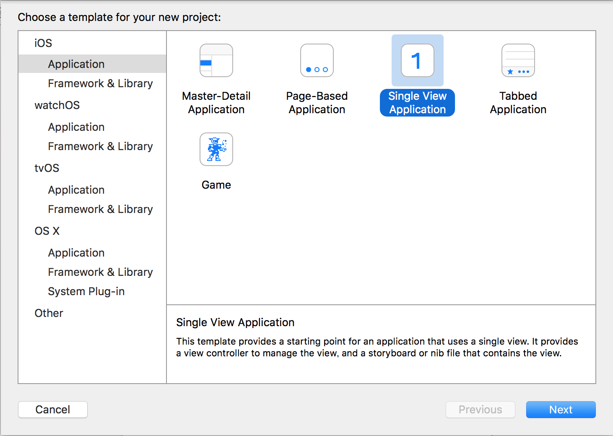
  1. `Choose options for your new project:` で以下のように入力して、Nextボタンを押します
     - Product Name: アプリ名
         - 今回は任意のものでOK
     - Organization Name:  開発者名
         - 今回は任意のものでOK
     - Organization identifier: 開発者を一意に識別するID ドメインを逆に並べたものを使用することが多いです
         - 今回は任意のものでOK
     - Language: 開発に使用するプログラミング言語 
         - 今回は `Swift` を選択
     - Devices: 対応する端末
     - 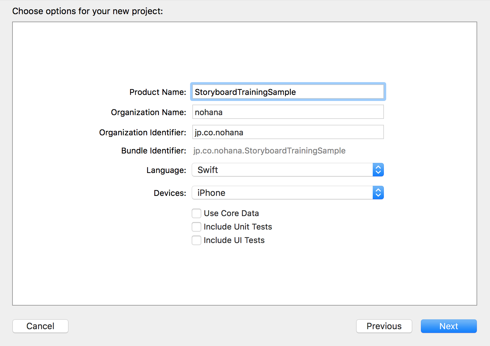
  1. プロジェクトの保存先を指定してCreateボタンを押します

## Xcodeの各エリアの名称

### Window

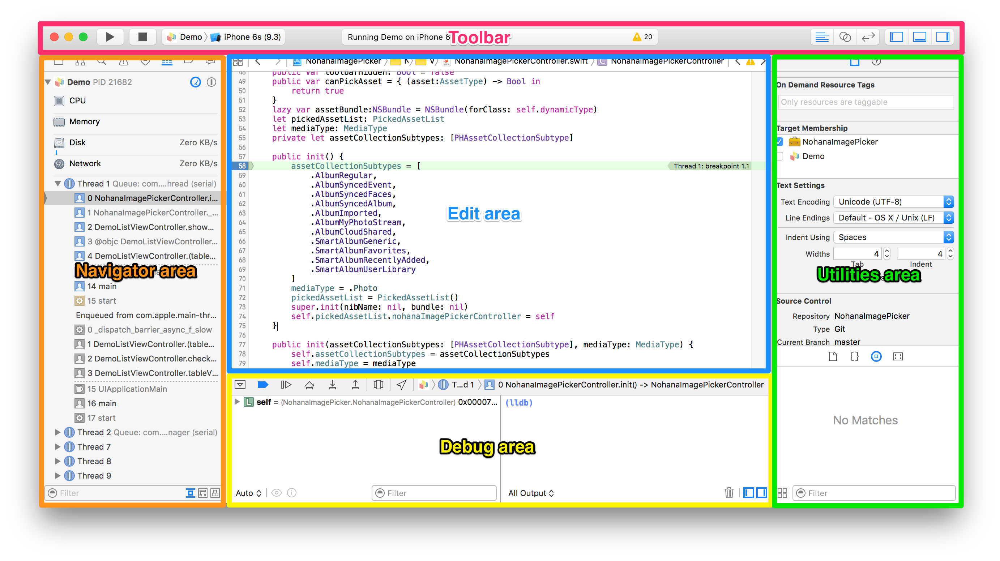 

### Editor

|アイコン|名称|説明|
|:--:|:--:|:--|
|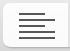|Standard editor|選択したコンテンツを表示し、編集するエリアです。<br/>ショートカットキーは `Command+Enter`。|
||Assistant editor|Standard editorに表示したコンテンツに関連するコンテンツを表示するエリアです。<br/>ショートカットキーは `Command+Option+Enter` 。<br/>また、Navigator areaで `Optionキーを押しながらコンテンツをクリック` で任意のファイルを表示することもできます。|
|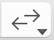|Version editor|過去のバージョンとの比較を表示するエリアです。この機能は、プロジェクトがバージョン管理されている時のみ使用可能です。<br/>ショートカットキーは `Command+Option+Shift+Enter` 。|

### Pane

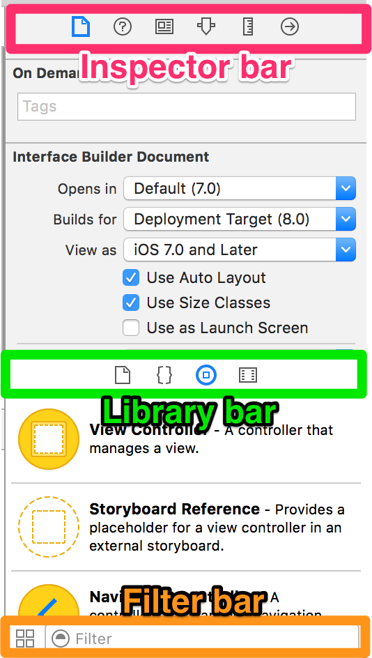

### Inspector pane

選択したファイル、オブジェクトの各種設定を表示、編集できます。

|アイコン|名称|説明|
|:--:|:--:|:--|
|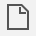|File inspector|選択したファイルのパスや名前などを表示、編集できます。|
||Quick Help|選択したインタフェースのエレメントや、ファイルの詳細を表示できます。|
||Identity inspector|オブジェクトのクラス名やRuntime attributesなどを表示、編集できます。|
||Attributes inspector|選択したインタフェースオブジェクトの属性を設定できます。|
|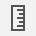|Size inspector|インタフェースオブジェクトの初期サイズ、位置などの特性を記入できます。|
||Connections inspector|インタフェースオブジェクトのOutletやActionを表示します。また、新しいConnectionを作成したり、既存のConnectionを削除したりできます。|


### Library pane

ここからNavigator areaやEditor areaにパーツをドラッグアンドドロップして、ソースコードやインタフェースオブジェクトを追加できます。 
パレットのようなものだと思ってください。

|アイコン|名称|説明|
|:--:|:--:|:--|
||File templates|Storyboard編集中には使いません。<br/>一般的なファイルのテンプレートです。Navigator areaにドラッグアンドドロップしてファイルを追加できます。|
||Code snippets|Storyboard編集中には使いません。<br/>Editor areaにドラッグアンドドロップで、コードスニペットをソースコードに追加できます。|
||Objects|**Storyboard編集中に頻繁に使います。**<br/>Editor areaにドラッグアンドドロップで、インタフェースオブジェクトをソースコードに追加できます。|
||Media files|画像、アイコン、音声ファイルなどをEditor areaにドラッグアンドドロップで、nibファイルに追加できます。|

## インタフェースオブジェクトの作成

### ラベルの作成

ラベルは文字を表示するインタフェースオブジェクトです。 
画面内にラベルを作成し、任意の文字列を表示してみましょう。

1. Navigator areaでMain.storyboardを選択します
1. Library paneのObjectsを表示します
1. `View Controller Scene` を選択します
1. `Label` を `View Controller Scene` 内にドラッグアンドドロップします
  - `View Controller Scene` の左上の方に置くようにしてください
  - インタフェースオブジェクトの種類が多くて見つけにくいので、下にあるフィルタを利用すると簡単に任意のインタフェースオブジェクトを配置できます
  - 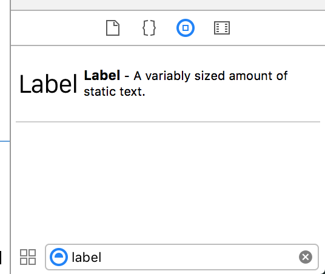
  - 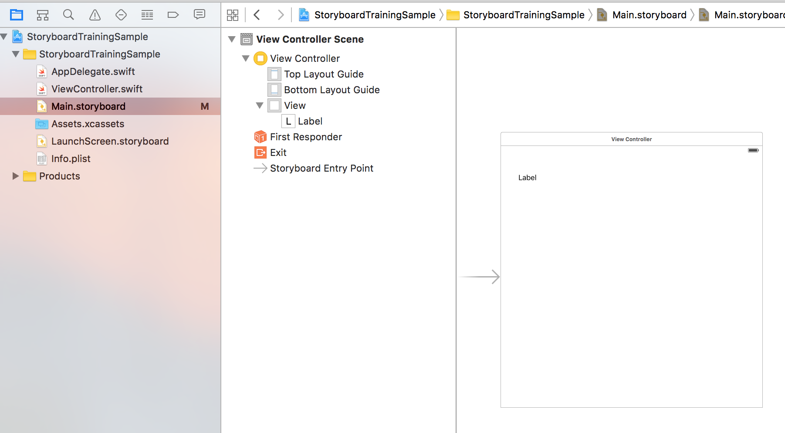
1. 作成したラベルを選択した状態で、 `Attribute inspector` を表示します
1. Textの下のテキストフィールドに任意の文字列を入力します
  - 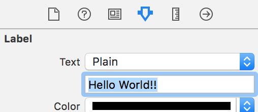
1. ↑で入力した文字列がラベル内で表示しきれない場合は、ラベルのサイズを調整します

#### やってみよう💪

1. Buttonを作成してみましょう
1. Viewを作成して、背景色を赤にしてみましょう
1. 背景が赤いViewの上にSwitchを作成してみましょう

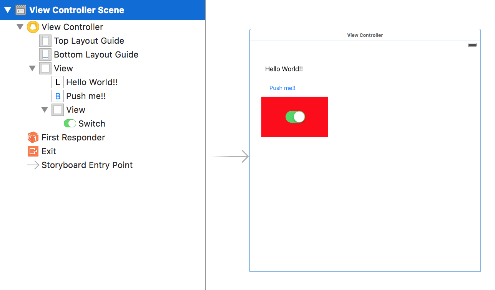

## シミュレータの起動

- Toolbarのデバイス名が表示されている所をクリックし、任意のデバイスを選択します
  - 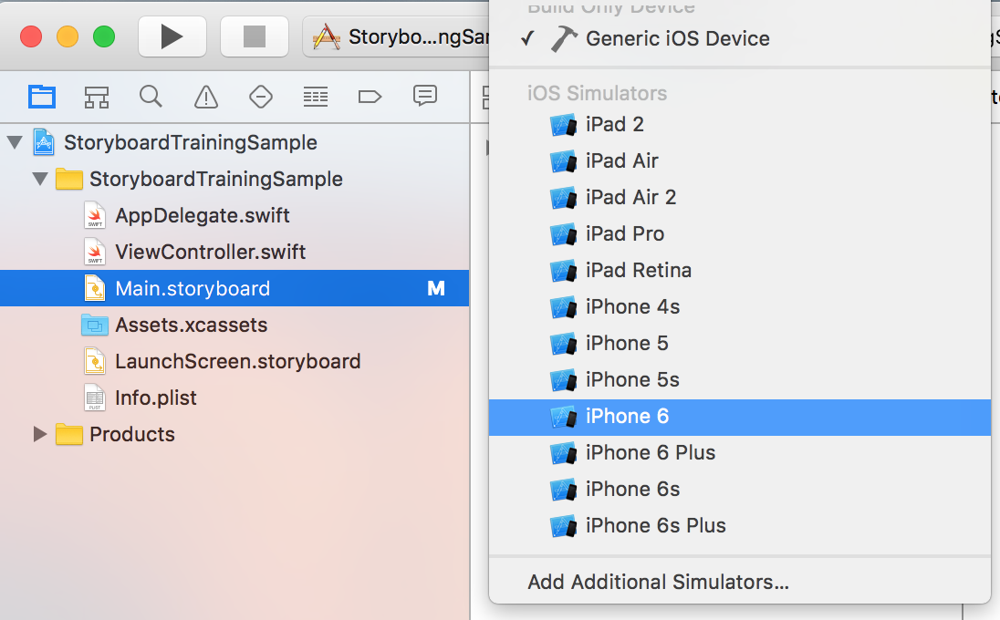
- Runボタン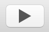を押します
  - ショートカットキーは `Command+r` です
- シミュレータが起動し、作成したインタフェースオブジェクトが表示されていれば成功です
  - シミュレータの初回の起動には時間がかかります
- Hardware > Rotate Left および Rotate Right で画面を回転できます
  - ショートカットキーは　`Command+←` および `Command+→` です

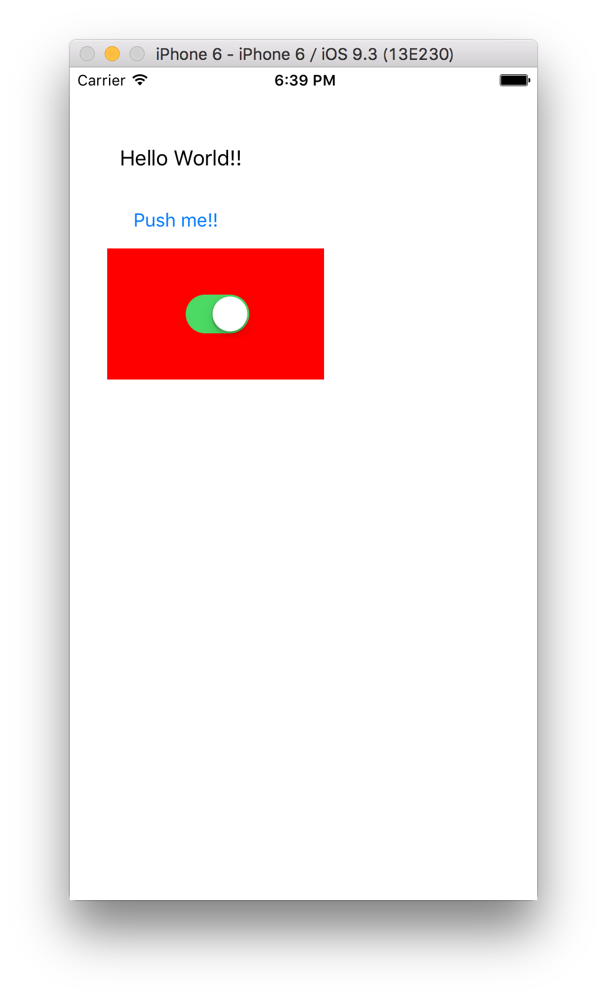

## Debug View Hierarchy

- シミュレータ起動中にDebug areaの  ボタンを押します
- Viewの階層が3D表示されます

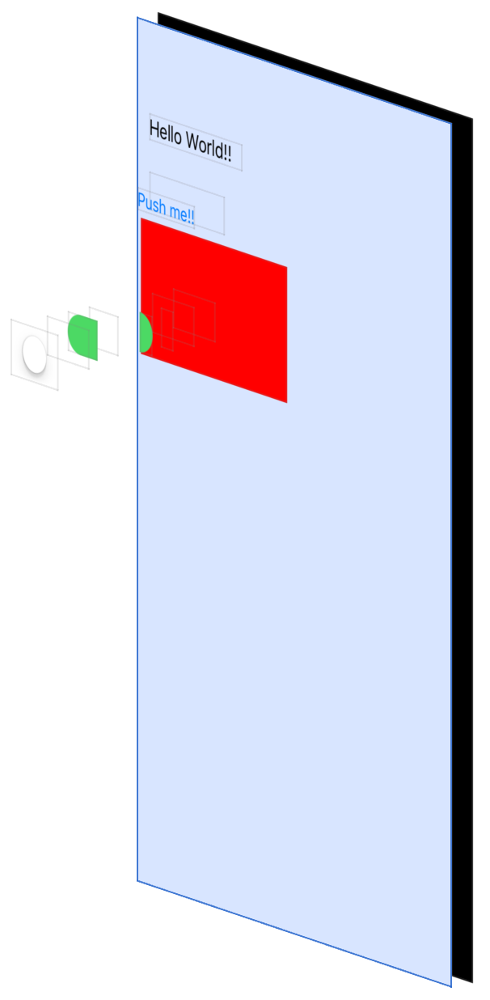

## Storyboard Preview

毎回シミュレータを起動するのは大変なので、レイアウトの確認にはStoryboardのPreview機能が便利です。

- Assistant editorを表示します
- Automaticと表示されている部分をクリックし、 Preview > Main Storyboard(Preview) を選択します
  - 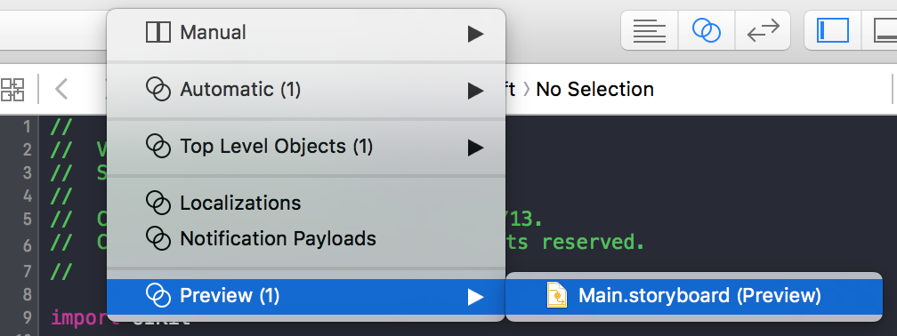
- Assistant editorの左下の `+` をクリックし任意のデバイスを選択します
  - 複数のデバイスでのレイアウトを同時に確認できます

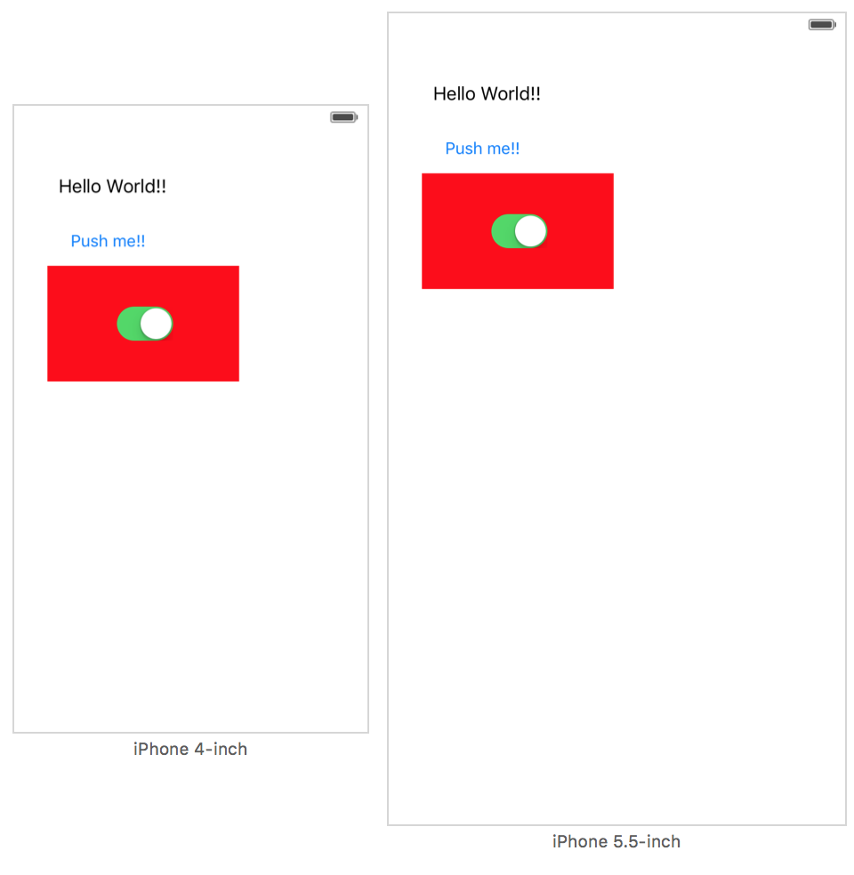

## Navigationbar

画面にNavigationbarを追加します

- `View Controller Scene` を選択します
- Editor > Embed In > Navigation Controller
  - 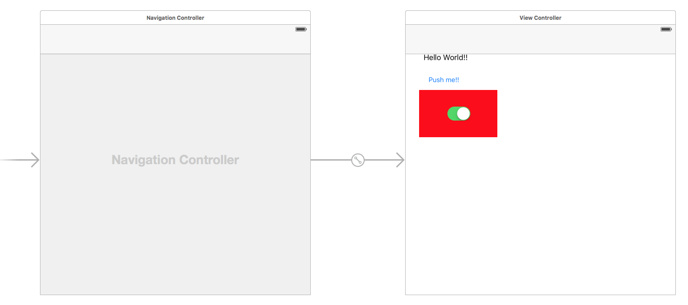
- シミュレータやStoryboard Previewでレイアウトを確認します


## Autolayout

### 概要

[Auto Layoutガイド：Auto Layoutの概要](https://developer.apple.com/jp/documentation/UserExperience/Conceptual/AutolayoutPG/index.html) 
Safariで閲覧すること

### 一緒にやろう👟

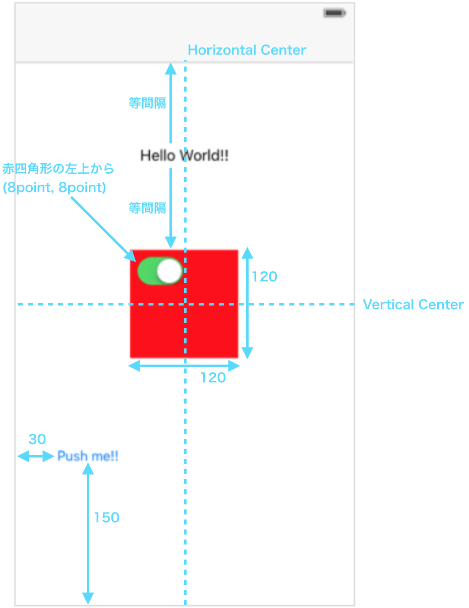


### エラーの確認

- 下図の様に赤または黄色の矢印が出ている場合は、なにかエラーまたは警告があるので修正する必要があります
- 矢印をクリックするとエラーまたは警告の詳細を確認できます 

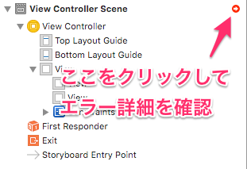

#### エラー詳細

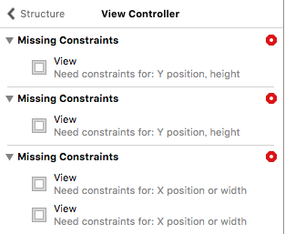

### Viewの自動再配置

- 下図のように黄色い点線でViewのサイズが表示される場合は、制約とViewの位置,サイズの間に不整合があります
  - 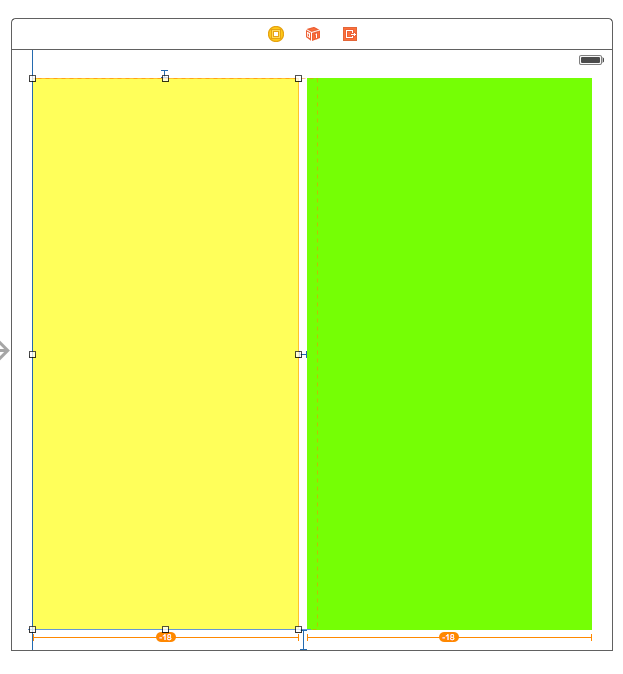
- この場合はStoryboardのViewの自動再配置機能を使用してViewを再配置します

1. 再配置したいViewを選択します
1. Edit area右下の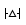ボタンをクリックします
1. `Update Frames` を選択します
1. Viewが自動的に再配置され、黄色の点線が消えます
1. `Update Constraints` を選択するとViewの位置,サイズに合わせて制約が変更されますが、制約に合わせてViewの位置,サイズを修正するほうがあるべき姿なので、こちらは使用しないほうがいいです


### マージン

`Push me!` ボタン配置を確認してください。良い例になっていればOKです。

### 良い例
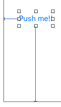

### 悪い例
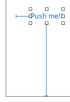

悪い例の状態になっている場合は、制約が `Relative to margin` になっている可能性があります。 
これは、iOSが定めているデフォルトのマージンからの距離の制約になっているという意味です。 
今回の場合は画面右端からの制約にしたいので  `Relative to margin` を解除します。

1. 制約をクリック または Size inspectorから制約をダブルクリック
1. 以下の画面で制約に `Margin` と書かれていることを確認します
  - 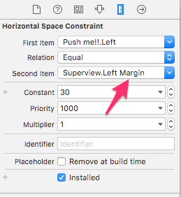
1. プルダウンメニューから `Relative to margin` を選択し、チェックをはずします
  - 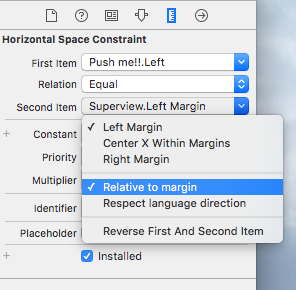
1. 制約が修正され、Viewが自動的に再配置されます

### やってみよう💪

回答は `./StoryboardTrainingSample/Base.lproj/Main.storyboard` 内にあります。

1. 全画面でマージンなしの水色のViewを作ってみましょう
  - 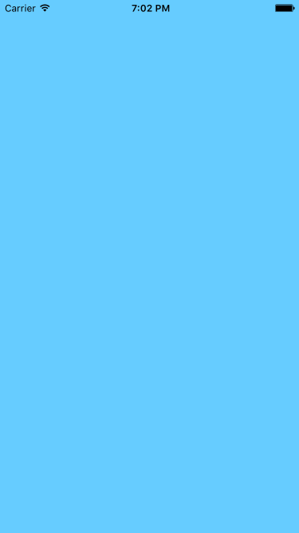
1. 以下のビューを作ってみましょう
  - Yellow View.Leading = Superview.LeadingMargin
  - Green View.Leading = Yellow View.Trailing + Standard
  - Green View.Trailing = Superview.TrailingMargin
  - Yellow View.Top = Top Layout Guide.Bottom + 20.0
  - Green View.Top = Top Layout Guide.Bottom + 20.0
  - Bottom Layout Guide.Top = Yellow View.Bottom + 20.0
  - Bottom Layout Guide.Top = Green View.Bottom + 20.0
  - Yellow View.Width = Green View.Width
  - 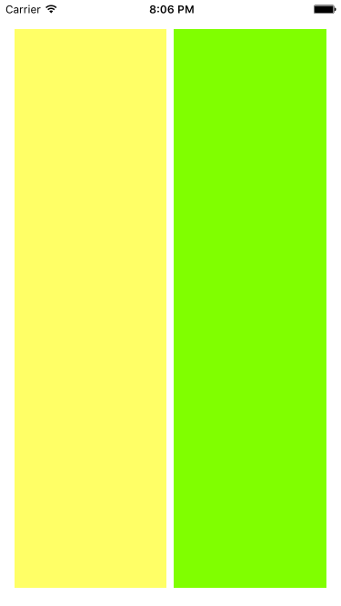
1. 等間隔に横に並ぶ4つのピンク色のビューを作ってみましょう
  - 4つのViewの横幅と縦幅は50ポイントに固定です
  - 左右のViewは画面左右端から0ポイントの位置にあります
  - 4つのViewの中央は画面の水平中央にあります
  - 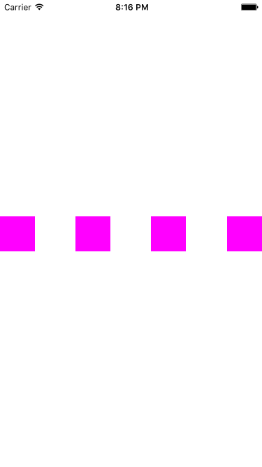

### Learn more

- [Auto Layoutの設計ベストプラクティスと、Viewの種類ごとのテクニック集 - Qiita](http://qiita.com/yuya_presto/items/08b0656f67a59c8c2d03)

## Asset Catalog

- [Asset Catalog Help](https://developer.apple.com/library/ios/recipes/xcode_help-image_catalog-1.0/chapters/Recipe.html)

## 参考資料

- [Xcode Basics Help](https://developer.apple.com/library/ios/recipes/xcode_help-general/Chapters/Recipe.html)
- [Storyboard Help](https://developer.apple.com/library/ios/recipes/xcode_help-IB_storyboard/_index.html#//apple_ref/doc/uid/TP40014225)
- [Xcode Overview: Designing with Storyboards](https://developer.apple.com/library/ios/documentation/ToolsLanguages/Conceptual/Xcode_Overview/DesigningwithStoryboards.html#//apple_ref/doc/uid/TP40010215-CH43-SW1)
- [2つ目のiOSアプリケーション：ストーリーボード (TP40011318 0.0.0) - SecondiOSAppTutorial.pdf](https://developer.apple.com/jp/documentation/SecondiOSAppTutorial.pdf)
- [Auto Layoutガイド (TP40010853 0.0.0) - AutolayoutPG.pdf](https://developer.apple.com/jp/documentation/AutolayoutPG.pdf)
- [Auto Layoutガイド：Auto Layoutの概要](https://developer.apple.com/jp/documentation/UserExperience/Conceptual/AutolayoutPG/index.html)
- [Asset Catalog Help](https://developer.apple.com/library/ios/recipes/xcode_help-image_catalog-1.0/chapters/Recipe.html)
- [今度こそ克服するAutoLayoutの使い方・基礎編～SwiftからはじめるiOSアプリ開発:その5【初心者向けアプリ開発3分tips】 - エンジニアtype](http://type.jp/et/log/article/ra-ios-tips06)

## ライセンス

この資料はApache License v2ライセンスの下に提供されています。 

```
Copyright (C) 2016 nohana, Inc. All rights reserved.

Licensed under the Apache License, Version 2.0 (the "License"); you may not use
this file except in compliance with the License. You may obtain a copy of the
License at

    http://www.apache.org/licenses/LICENSE-2.0

Unless required by applicable law or agreed to in writing, software distributed
under the License is distributed on an "AS IS" BASIS, WITHOUT WARRANTIES OR
CONDITIONS OF ANY KIND, either express or implied. See the License for the
specific language governing permissions and limitations under the License.
```
